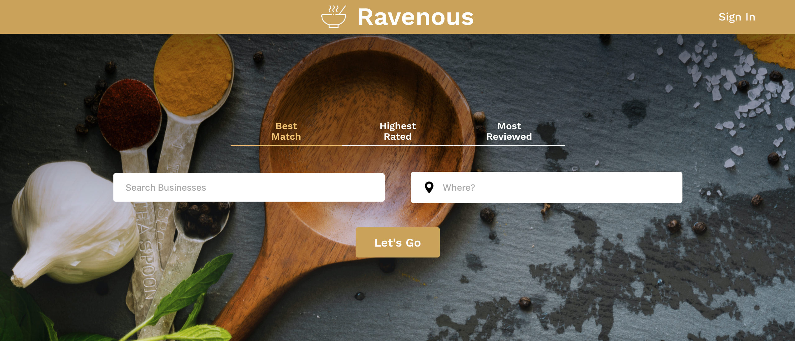
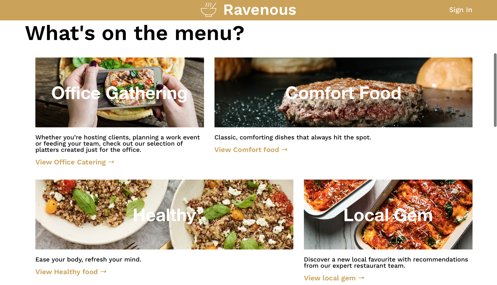
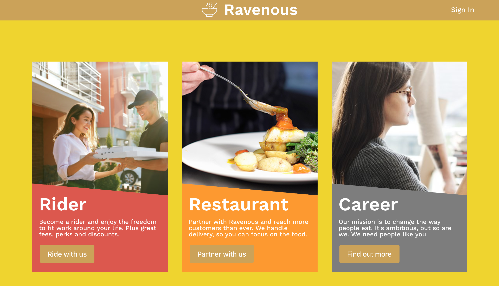
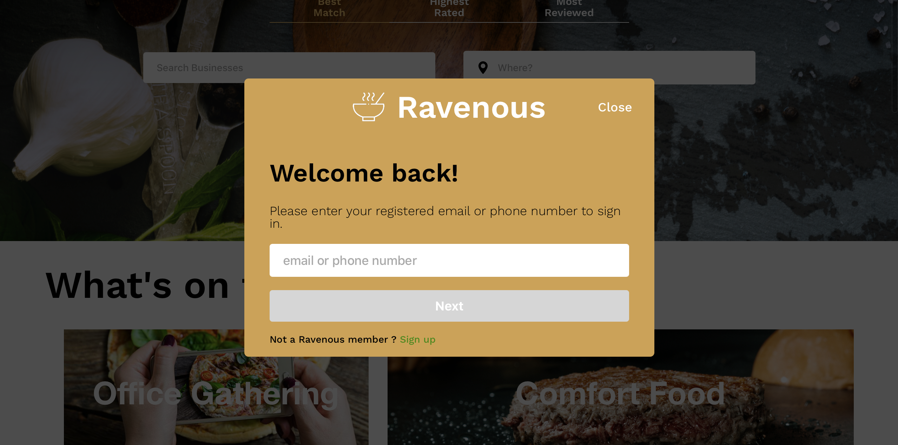
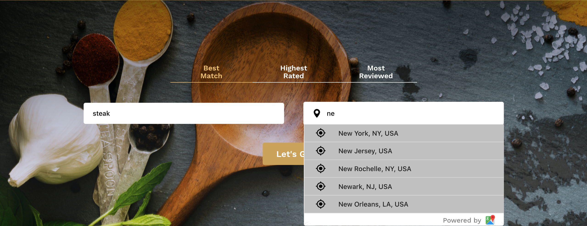
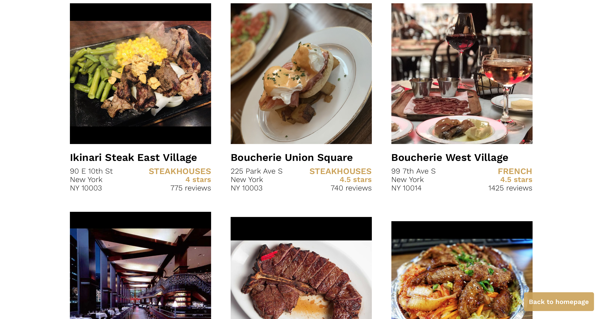

English | [简体中文](./README-ch.md)

## Ravenous Menu 
A restaurant search and rating website using Yelp and Google Map API. This is my practice project for learning React.js. 

### Address 
[GitHub](https://github.com/ProgrammableEric/ravenousMenu)

[Website online](https://ravenous-menu.now.sh)

### Technology involved
React, sass

[Yelp search API](https://www.yelp.com/developers), [Google Map Places API](https://developers.google.com/places/web-service/intro)

### Demo with screenshot 

### Features
- [x] Webpage layout
- [x] Page Responsive features
- [x] Search bar auto complete using Google Places API 
- [x] Yelp API Request and response 
- [x] Search result presentation 
- [x] Modal box 
- [x] Several animation effects 
- [x] Input check and alert before submitting search request 

### Author 
- Eric Fu - [GitHub](https://github.com/ProgrammableEric)

### Acknowledgement 
- [Code Academy](https://github.com/ZachCase/ravenous) for project idea.
